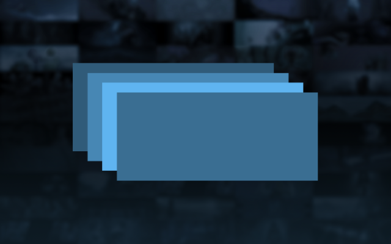
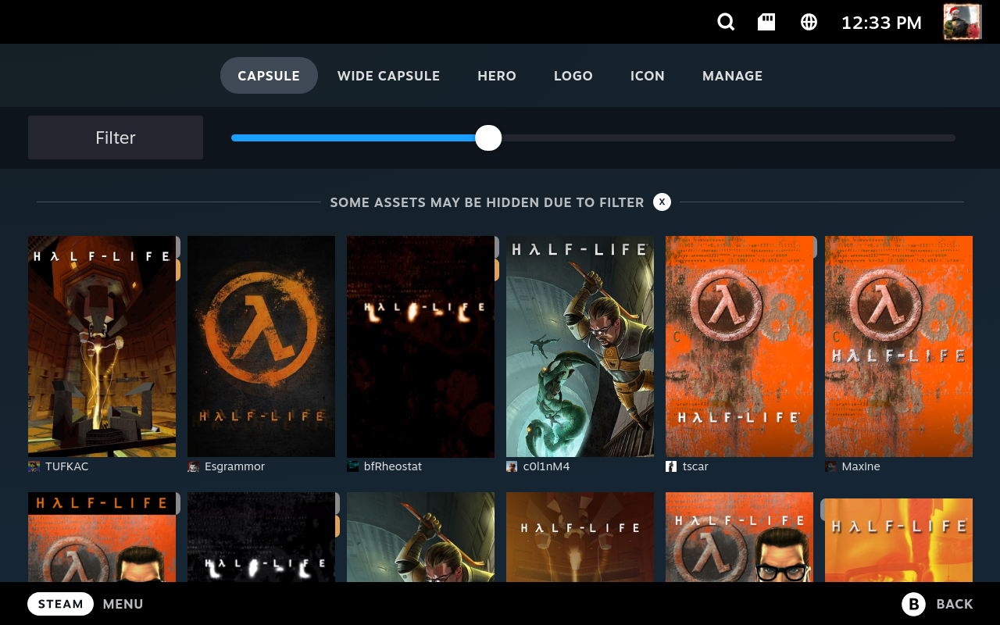
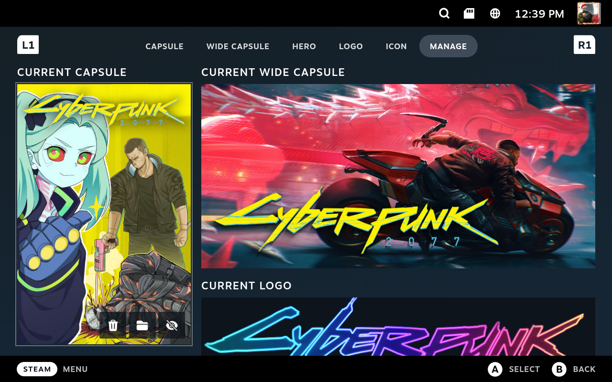
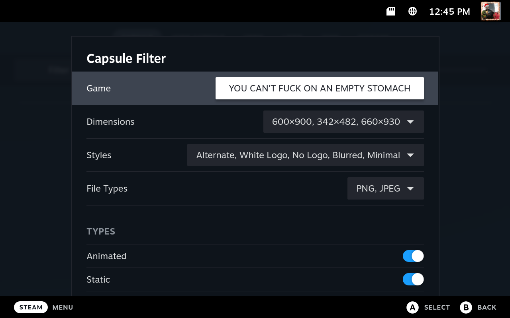
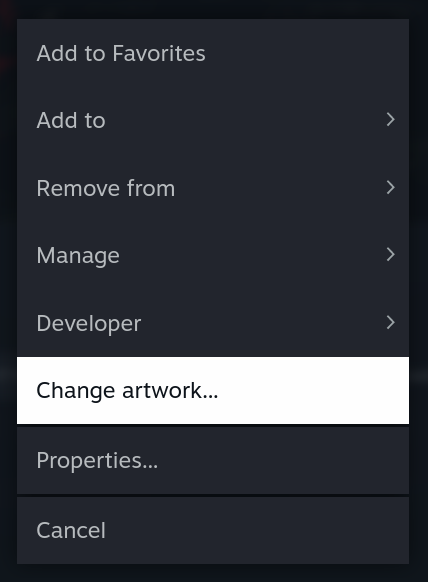

  

<h1 align="center">SteamGridDB plugin for Decky Loader</h1>

Easily browse and manage Steam artwork from SteamGridDB or your local files from within gaming mode.

## Features
- Browse assets from SteamGridDB for the selected game.
- Support for non-Steam shortcuts and Source/GoldSrc mods.
- Ability to change icons for Steam or non-Steam shortcuts.
- Manually select images from the local file system.
- Utility to apply invisible assets.
- Ability to reset custom images back to default.
- Logo positioner.

## Installation
1. Install [Decky Loader](https://deckbrew.xyz/en/user-guide/install)
2. Open the Quick Access menu
3. Open the Plugins Browser <picture>
    <source media="(prefers-color-scheme: dark)" srcset="docs/store-light.svg">
    <source media="(prefers-color-scheme: light)" srcset="docs/store-dark.svg">
    
    </picture>
4. Find SteamGridDB and press "Install"

## Usage
Select "Change artwork..." from a game context menu.  

You can access the menu by focusing on a game in your library and pressing <picture><source media="(prefers-color-scheme: dark)" srcset="docs/start-light.svg"><source media="(prefers-color-scheme: light)" srcset="docs/start-dark.svg"></picture>.  
Or by using the <picture><source media="(prefers-color-scheme: dark)" srcset="docs/menucog-light.svg"><source media="(prefers-color-scheme: light)" srcset="docs/menucog-dark.svg"></picture> button on a game page.

  

# Credits
**Early Testing:** Emenesu, Mr. Mendelli  
**Development Help:** [SDH Discord](https://discord.gg/ZU74G2NJzk)  
**Localisation:**
| | |
| - | - |
| **Čeština** | zenobit |
| **Deutsch** | Kurikuo, benutzer_artur7, Anja |
| **Español-España** | Andrea Laguillo, Kam, m0uch0 |
| **Español-Latinoamérica** | Kam |
| **Français** | Michael Jean |
| **Italiano** | SpagottoB37 |
| **Nederlands** | Phanpy100 (Fanny), Jannes Verlinde |
| **Polski** | DRS, Michał Kwiatkowski |
| **Português-Brasil** | Oregano, Thomas Eric |
| **Português** | Kokasgui |
| **Română** | Munt |
| **Svenska** | Moneyman Dan |
| **Ελληνικά** | Emenesu |
| **Русский** | fycher |
| **Українська** | Veydzher |
| **한국어** | yor42 |
| **日本語** | Nes |
| **正體中文** | mingyc |
| **简体中文** | zhzy0077 |
